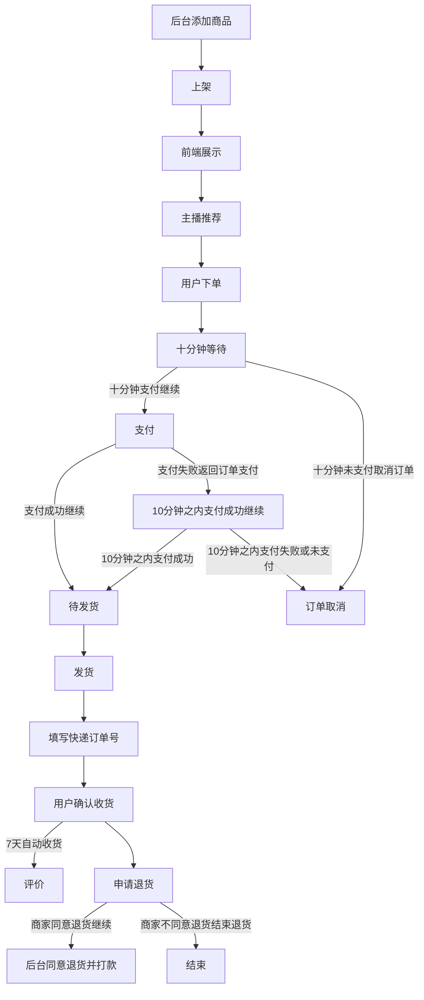

```mermaid
graph TD
    A[后台添加商品] --> B[上架]
    B --> C[前端展示]
    C --> D[主播推荐]
    D --> E[用户下单]
    E --> F[十分钟等待]
    F -->|十分钟支付继续| G[支付]
    F -->|十分钟未支付取消订单| H[订单取消]
    G -->|支付成功继续| I[待发货]
    G -->|支付失败返回订单支付| J[10分钟之内支付成功继续]
    J -->|10分钟之内支付成功| I
    J -->|10分钟之内支付失败或未支付| H
    I --> K[发货]
    K --> L[填写快递订单号]
    L --> M[用户确认收货]
    M -->|7天自动收货| N[评价]
    M --> O[申请退货]
    O -->|商家同意退货继续| P[后台同意退货并打款]
    O -->|商家不同意退货结束退货| Q[结束]
    
```